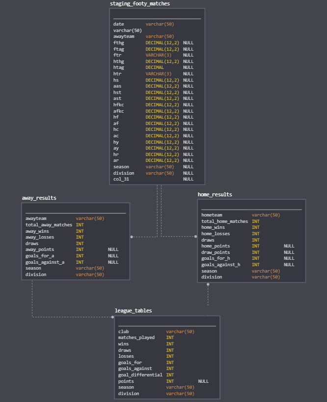

# FootyDash

### A Soccer Analytics Warehouse and a Capstone Project.

## Introduction
The purpose of this dashboard is to display soccer data in a digestible way. In the past few years we've finally seen an explosion within the soccer community to actually use and digest data on the great game to better the performance of our favorite teams. With that being said, I want to build out my own analysis on the teams of each major European league (only because this is the easiest to get information on). I had previously built this dashboard using the tools I knew before taking the Data Engineering course on Udacity, but now with my new found skills I believe I can create something much more robust and concise. 

## The Process 
Getting soccer data isn't necessarily easy to come by unfortunately. Soccer has yet to reach that level of data authenticity where people are using it for their own analysis or their own projects, which doesn't mirror American sports at all. To start we obviously need information, and where do we get information? The internet! Fortunately for us we have this phenomenal website [http://www.football-data.co.uk/data.php] which has a ton of CSV's worth of historical data and current weekly match data (think things like wins, draws. losses, shots, fouls etc). Now I know this isn't the greatest bit of information but for now this will do. Now for the steps:

1. Get the initial data. Now this can be done one of two ways. Write a selenium script to go through each link and click the CSV downloads to then save the CSV, or just manually grabbing each CSV for each league. This in some way will need to get automated in the future.
2. Once we have the CSV's we need (Serie A, Bundesliga, Premier League ETC) we can then create an S3 bucket in AWS to store all of this information. For this we can use python to iterate through a directory and upload them individually relative to the league and division (Prem or Championship)
3. So, now that we have all this information we need to create the subset of tables to warehouse into an RDS instance or Redshift. For right now, I want to upload all this data into one table, as it isn't too much information to begin with. Then from there split it up into tables we can pull from quicker and easier. 
4. Now that the queries are all set we can focus on actually inserting the information into our tables from S3. 
6. Using our queries we've inserted the data and it lives! Now we can build a web app to display the information in either Plotly Dash or Django which will be a different project down the line. 

## The ETL Pipeline
An Image of what I believe will be the data pipeline:

CSV's -> Cleaning the CSV's -> S3 -> Creating tables/inserts -> Redshift -> Analytics Application (plotly dash/django app) (Future)

##Nice visuals for your viewing experience:

## What you need.
First and foremost you will need to create an AWS account with Amazon and you will need python 3.x on your machine. This should take no time at all. 
The code will handle everything from creating the bucket/DB and the roles for Redshift. 
Make sure to store your AWS keys in a safe place.

Lastly make sure to install everything from the requirements.txt file as you will need it. 
Also you will need to download a chromedriver which can be found here for windows: https://chromedriver.chromium.org/downloads

    #AWS login info (keep this safe)
    KEY = {'Enter Access Key Here'}
    SECRET = {'Enter Secret Key Here'}
    
    #whatever you want the buckname to be 
    BUCKETNAME = {'Enter Bucket Name Here'}
    
    #the iam role is just user settings in aws (give it a nice name)
    IAM_ROLE_NAME = ''
    
    #this is for your redshift cluster - pass in the creds you want
    DB_NAME = ''
    CLUSTER_IDENTIFIER = ''
    REDSHIFT_USERNAME = ''
    REDSHIFT_PASSWORD = ''
    
    #dont change the port
    PORT = 5439 
    
    #example file locations for where to store the intial downloaded data from selenium
    file_path = r'C:\Users\\Desktop\\'
    s3_path = r'C:\Users\\Desktop\footy_data_sets'
    
    #need this to actually use Seleniums chrome driver
    chromeDriver = r'C:\Users\chromedriver\chromedriver_win32\chromedriver.exe'
    
Once you've updated the config file you're all set! Just run the program in your desired IDE and watch it go. In about (+-) ten
minutes you'll have data stored in S3 and then shipped over to Redshift for analysis. Just a reminder before you go off and do this
Redshift is not a free service and does cost a good bit if you keep this running for a long time. So if you need to just
delete the cluster and re-run this program. Just a heads up there is a portion of the program where it waits until
the Redshift cluster actually becomes available, this may take some time. 

## Definitions for the data in the staging table for this program:
    Key to results data:
    
    Date = Match Date (dd/mm/yy)
    Time = Time of match kick off
    HomeTeam = Home Team
    AwayTeam = Away Team
    FTHG and HG = Full Time Home Team Goals
    FTAG and AG = Full Time Away Team Goals
    FTR and Res = Full Time Result (H=Home Win, D=Draw, A=Away Win)
    HTHG = Half Time Home Team Goals
    HTAG = Half Time Away Team Goals
    HTR = Half Time Result (H=Home Win, D=Draw, A=Away Win)
    
    Match Statistics (where available)
    
    HS = Home Team Shots
    AS = Away Team Shots
    HST = Home Team Shots on Target
    AST = Away Team Shots on Target
    HHW = Home Team Hit Woodwork
    AHW = Away Team Hit Woodwork
    HC = Home Team Corners
    AC = Away Team Corners
    HF = Home Team Fouls Committed
    AF = Away Team Fouls Committed
    HFKC = Home Team Free Kicks Conceded
    AFKC = Away Team Free Kicks Conceded
    HO = Home Team Offsides
    AO = Away Team Offsides
    HY = Home Team Yellow Cards
    AY = Away Team Yellow Cards
    HR = Home Team Red Cards
    AR = Away Team Red Cards
    
## Whats to come:
I want to build out more tables and possibly get more data from more sources into the Redshift Warehouse. I will 
create a new repository for the visual portion of this project, but I need to get more stats together! You can find my 
old project here, but a much much less robust way of uploading this data and very slow calculations in plotly dash. 
(https://github.com/salarchitetto/Footy)

## Other Scenarios
I think if they data increased 100x I would need to find a way to better map the data from S3 to Redshift. 
The way i'm doing it now works completely fine but I don't think it's scalable. Right now this ETL pipeline will 
only run once, and that's up to you on when you'd like to run it. If it need to run every day I would set up 
another portion in my pipeline which would include Apache's Airflow. We would be able to set up the DAG to run daily
at 7am. I believe I will implement this in the near future. I think I would only need to tweak some minor things 
for this to be accessed to 100 people. I have the function to create the roles, I could just create another function to
actually have it create user's who could then be able to login into the cluster/S3 bucket. 
